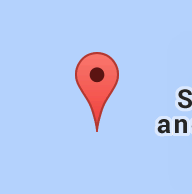
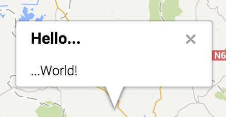
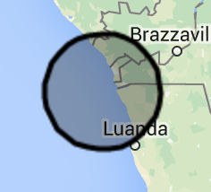
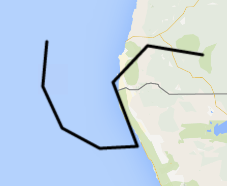
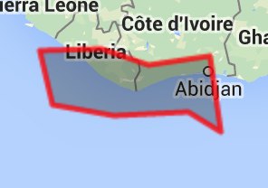

### Introduction

Quite a number of the objects below define `lat` and `lng` properties. Any reference to `lat` and `lng` in the following documentation refers to the latitude and longitude values of the object currently under discussion. Each of the `lat` and `lng` properties are of type `number`.


## The Main `{{google-map}}` Component

The centerpiece of this addon is of course the map component. You can use the component by placing the following within your templates: `{{google-map}}`.

All of the other attributes of the map are defined as properties. Each of these properties is described below. Each of the properties listed are bound using two way data-binding. This means that when any of the property values is changed within your Ember application code the new values will be reflected on the map and that any changes the user makes to the map itself will will be reflected in your Ember objects. As a consequence of two way data binding, you should not use the same object or properties to, for example, define the center of the map  and to define the position of the first marker. If you want to implement functionality that binds the same property to multiple objects, you'll need to have another property defined in your controller that links to the first marker position using `Ember.computed.reads` (or `oneWay`).

### Basic properties

- **`lat`** and **`lng`** (type: `number`, default value: `0`)

    These properties are used to define (and track) the center of the map.

- **`type`** (type `string`, default value: `road`)

    The type of the map. Possible values are `road`, `satellite`, `terrain` and `hybrid`.

- **`zoom`** (type `number`, default value: `5`)

    How zoomed in the map is. Zoom must be a `number` between `0` and `18` but it is limited depending on the type of map you're using. See the [Google Documentation](https://developers.google.com/maps/documentation/javascript/maxzoom).

- **`fitBoundsArray`** (type: `Array.<{lat: number, lng: number}>`, default value: _automatically calculated depending on the value of `autoFitBounds`_)

    An array of objects containing `lat` and `lng` coordinates. All of the points within the array will be used to center and zoom the map so that it can render all of the given positions within the google map canvas. Do not set this if you have defined `autoFitBounds` to something else than `false` (see below).

- **`autoFitBounds`** (type: `boolean` or `string`, default value: `false`)

    If it is a `boolean`, setting `autoFitBounds` to `false` will do nothing. If `autoFitBounds` is set to `true` it will automatically center and zoom the map so that all of the [[objects you defined on the map|Provided-Tools-and-Classes-(API)#defining-objects-to-draw]] will be visible.

    If it is a `string`, `autoFitBounds` should contain a list of the type of objects which will all be fit onto the map. Providing a list of the types of objects to fit on the map, will cause the component to behave similarly to if you had set `autoFitBounds` to `true`, except the map will only zoom and focus to accommodate objects of the given type(s) . For example, providing a value of `markers,circles` would center and zoom the map so that all markers and circle are visible, but would not try to ensure that other objects (such as `polylines` or 'polygons') are within the map's bounds. Valid types to be included in the list of object types are: `markers`, `infoWindows`, `circles`, `polylines` and `polygons`.


### Google options as properties

Any [Google Maps option](https://developers.google.com/maps/documentation/javascript/reference#MapOptions) which is not handled by a component property can be set using prefixed the option name given by Google with **`gopt_`**.

For example, to disable the zoom controls (Google Maps option named `zoomControl`):

```handlebars
{{google-map ... gopt_zoomControl=false}}
```

Any [[view|Provided-Tools-and-Classes-(API)#views]] corresponding to a Google Maps object can also be bound to an option provided by Google in the same manner. Refer to the [Google Maps documentation](https://developers.google.com/maps/documentation/javascript/reference) for possible settings.

Note that any Google Maps options that are set using property names prefaced with `gopt_` will be read only after initialization.


### Defining objects to draw


Each type of drawable object (objects which Google calls _overlay_s) that can be displayed on the map has a corresponding **array** property on the component. Setting each property with an array you define let's you define what will be drawn on the map. There is a list of the things that you can draw on the map below. Note that each of these arrays are bound to the map with two way data binding so that they will track changes that are made by the user and the map will reflect updates when you change the content of the arrays from within your code:

#### Markers

- Google type: [google.maps.Marker](https://developers.google.com/maps/documentation/javascript/reference#Marker)
- Component property: **`markers`**
- Events: **`click`**, **`dblclick`**, **`drag`**, **`dragend`**, **`dragstart`**, **`mousedown`**, **`mouseout`**, **`mouseover`**, **`mouseup`** and **`rightclick`**
- Special component properties:
    - **`markerController`**: name of the controller to use for each marker, must extend `google-map/marker` controller
    - **`markerViewClass`**: name or class of the view to use for each marker, must extend `google-map/marker` view
    - **`markerInfoWindowTemplateName`**: name of the template to use for all marker info-windows
    - **`markerHasInfoWindow`**: the default `hasInfoWindow` value if not set for each marker (see below)

**Each marker has these properties:**

- **`lat`** and **`lng`**: coordinates of the marker, **mandatory**
- **`isClickable`** (`boolean`): whether the marker is clickable or not
- **`isVisible`** (`boolean`): whether the marker is visible or not
- **`isDraggable`** (`boolean`): whether the marker is draggable or not
- **`title`** (`string`): title of the marker (visible on hover)
- **`opacity`** (`number`): opacity of the marker
- **`icon`** (`string` or [`google.maps.Icon`](https://developers.google.com/maps/documentation/javascript/reference#Icon)): icon of the marker
- **`zIndex`** (`number`): z-index of the marker
- **`hasInfoWindow`** (`boolean`): whether there is an info-window attached to this marker or not
- **`description`** (`string`): will be used to fill the attached info-window if no template has been specified
- **`isInfoWindowVisible`** (`boolean`): whether the attached info-window is visible or not
- **`infoWindowTemplateName`** (`string`): template to be used for the info-window

#### Info Windows

- Google type: [google.maps.InfoWindow](https://developers.google.com/maps/documentation/javascript/reference#InfoWindow)
- Component property: **`infoWindows`**
- Events: **`closeclick`** and **`domready`**
- _If you want to attach an info-window to a marker, use the built-in marker's info-window properties instead (see above)_
- Special component properties:
    - **`infoWindowController`**: name of the controller to use for each info-window, must extend `google-map/info-window` controller
    - **`infoWindowViewClass`**: name or class of the view to use for each info-window, must extend `google-map/info-window` view
    - **`infoWindowTemplateName`**: name of the template to use for each info-window

**Each info-window has these properties:**
- **`lat`** and **`lng`**: coordinates of the info-window, **mandatory**
- **`isVisible`** (`boolean`): whether the info-window is visible or not
- **`zIndex`** (`number`): z-index of the info-window
- **`title`** (`string`): title of the info-window
- **`description`** (`string`): body of the info-window
- **`templateName`** (`string`): name of the template to use for the info-window

#### Circles

- Google type: [google.maps.Circle](https://developers.google.com/maps/documentation/javascript/reference#Circle)
- Component property: **`circles`**
- Events: **`click`**, **`dblclick`**, **`drag`**, **`dragend`**, **`dragstart`**, **`mousedown`**, **`mouseout`**, **`mouseover`**, **`mouseup`** and **`rightclick`**
- Special component properties:
    - **`circleController`**: name of the controller to use for each circle, must extend `google-map/circle` controller
    - **`circleViewClass`**: name or class of the view to use for each circle, must extend `google-map/circle` view

**Each circle has these properties:**
- **`lat`** and **`lng`**: coordinates of the circle, **mandatory**
- **`radius`** (`number`): radius of the circle (in meters), **mandatory**
- **`isClickable`** (`boolean`): whether the circle is clickable or not
- **`isVisible`** (`boolean`): whether the circle is visible or not
- **`isDraggable`** (`boolean`): whether the circle is draggable or not
- **`isEditable`** (`boolean`): whether the circle is editable or not
- **`strokeColor`** (`string`): css color of the circle's stroke (read-only after creation)
- **`strokeOpacity`** (`number`): opacity of the circle's stroke (read-only after creation)
- **`strokeWeight`** (`number`): weight of the circle's stroke (read-only after creation)
- **`fillColor`** (`string`): css color of the circle's fill (read-only after creation)
- **`fillOpacity`** (`number`): opacity of the circle's fill (read-only after creation)
- **`zIndex`** (`number`): z-index of the circle

#### Polylines

- Google type: [google.maps.Polyline](https://developers.google.com/maps/documentation/javascript/reference#Polyline)
- Component property: **`polylines`**
- Events: **`click`**, **`dblclick`**, **`drag`**, **`dragend`**, **`dragstart`**, **`mousedown`**, **`mouseout`**, **`mouseover`**, **`mouseup`** and **`rightclick`**
- Special component properties:
    - **`polylineController`**: name of the controller to use for each polyline, must extend `google-map/polyline` controller
    - **`polylinePathController`**: name of the controller to use for each polyline path, must extend `google-map/polyline-path` controller
    - **`polylineViewClass`**: name or class of the view to use for each polyline, must extend `google-map/polyline` view

**Each polyline has these properties:**
- **`lat`** and **`lng`**: coordinates of the polyline, **mandatory**
- **`path`** (`Array.<{lat: number, lng: number}>`): path of the polyline (each item represents a point on the path), **mandatory**
- **`icons`** ([`Array.<google.maps.IconSequence>`](https://developers.google.com/maps/documentation/javascript/reference#IconSequence)): the icons to be rendered along the polyline
- **`isClickable`** (`boolean`): whether the polyline is clickable or not
- **`isVisible`** (`boolean`): whether the polyline is visible or not
- **`isDraggable`** (`boolean`): whether the polyline is draggable or not
- **`isEditable`** (`boolean`): whether the polyline is editable or not
- **`isGeodesic`** (`boolean`): whether the polyline is geodesic or not (when `true` the edges follow the curvature of the Earth)
- **`strokeColor`** (`string`): css color of the polyline's stroke (read-only after creation)
- **`strokeOpacity`** (`number`): opacity of the polyline's stroke (read-only after creation)
- **`strokeWeight`** (`number`): weight of the polyline's stroke (read-only after creation)
- **`zIndex`** (`number`): z-index of the polyline

#### Polygons

- Google type: [google.maps.Polygon](https://developers.google.com/maps/documentation/javascript/reference#Polygon)
- Component property: **`polygons`**
- Events: **`click`**, **`dblclick`**, **`drag`**, **`dragend`**, **`dragstart`**, **`mousedown`**, **`mouseout`**, **`mouseover`**, **`mouseup`** and **`rightclick`**
- Special component properties:
    - **`polygonController`**: name of the controller to use for each polygon, must extend `google-map/polygon` controller
    - **`polygonPathController`**: name of the controller to use for each polygon path, must extend `google-map/polygon-path` controller
    - **`polygonViewClass`**: name or class of the view to use for each polygon, must extend `google-map/polygon` view

**Each polygon has these properties:**
- **`lat`** and **`lng`**: coordinates of the polygon, **mandatory**
- **`path`** (`Array.<{lat: number, lng: number}>`): path of the polygon (each item represents a point of the path), **mandatory**
- **`icons`** ([`Array.<google.maps.IconSequence>`](https://developers.google.com/maps/documentation/javascript/reference#IconSequence)): the icons to be rendered along the polygon
- **`isClickable`** (`boolean`): whether the polygon is clickable or not
- **`isVisible`** (`boolean`): whether the polygon is visible or not
- **`isDraggable`** (`boolean`): whether the polygon is draggable or not
- **`isEditable`** (`boolean`): whether the polygon is editable or not
- **`isGeodesic`** (`boolean`): whether the polygon is geodesic or not (when `true` the edges follow the curvature of the Earth)
- **`strokeColor`** (`string`): css color of the polygon's stroke (read-only after creation)
- **`strokeOpacity`** (`number`): opacity of the polygon's stroke (read-only after creation)
- **`strokeWeight`** (`number`): weight of the polygon's stroke (read-only after creation)
- **`fillColor`** (`string`): css color of the polygon's fill (read-only after creation)
- **`fillOpacity`** (`number`): opacity of the polygon's fill (read-only after creation)
- **`zIndex`** (`number`): z-index of the polygon


## Controllers
### Introduction

While you do not need to specify and extend any controller, you have the possibility of extending them in order to have full control over your map overlay objects. This allows you to have models for these objects which do not reflect the expected property names, for example, or to handle specific actions when a property value changes.

All controllers are injected in the `app/controllers/google-map` path when the application is built. Suppose for example that you want to extend the `marker` controller in `app/controllers/my-marker.js`:

```js
import GoogleMapMarkerController from './google-map/marker';

export default GoogleMapMarkerController.extend({
  // ...
});
```

### Available controllers

Each overlay object type has a controller which is used as the `itemController` for the associated array of objects. These controllers are named in line with their object types extend `Ember.ObjectController`.

The `polylines` and `polygons` each have an additional path controller (`google-map/polyline-path` and `google-map/polygon-path`). The `polyline-path` and `polygon-path` controllers each extend `Ember.ArrayController` so that you can handle the behavior of their paths, for instance if you wanted to listen for changes along an entire path or if you wanted to round values of a path, etc.

Here is the list of all controllers created by the add-on. Each of them is injected into the path `app/controllers/google-map`:
- **`marker`**
- **`info-window`**
- **`circle`**
- **`polyline`**
- **`polyline-path`**
- **`polygon`**
- **`polygon-path`**

### Example use-case: custom `lat` and `lng` property names

Let's say that your marker model does not have `lat` and `lng` properties but instead a `coords` object with `latitude` and `longitude` properties. To make the component work properly, you'll need to:

1. extend the `google-map/marker` controller (we will do this in `app/controllers/map/my-marker.js)`:

    ```js
    import GoogleMapMarkerController from '../google-map/marker';

    export default GoogleMapMarkerController.extend({
      lat: Ember.computed.alias('coords.latitude'),
      lng: Ember.computed.alias('coords.longitude')
    });
    ```

2. inform the component that you want to use your own controller (in `app/templates/map.hbs`):

    ```handlebars
    {{google-map ... markerController='map/my-marker'}}
    ```

...and voila, now your records/objects will be used correctly and updated if the markers are draggable and the user moves them.


## Views

### Introduction

You do not need to define and extend the views to be used with your controllers, but defining them can be useful if you need to listen for the `click` event, for example.

All views are injected in the `app/views/google-map` path when the application is built. Let's say for example that you wanted to extend the `marker` view in `app/views/my-marker.js`:

```js
import GoogleMapMarkerView from './google-map/marker';

export default GoogleMapMarkerView.extend({
  // ...
});
```

### Available views

Each overlay object type has a view which is used to represent it.  The views may only be generated in memory, but they always exist and represent each overlay object drawn on the map. Each view is named after the particular object type it represents and extends `Ember.View`.

Here is the list of all views available. Each of them are injected into the `app/views/google-map` path:
- **`marker`**
- **`info-window`**
- **`circle`**
- **`polyline`**
- **`polygon`**

### Events

To listen for any of the available Google events that are listed in the section for each overlay type above, you will need to extend the view for a particular overlay type and define what you want to do for the events  you want to handle in the `googleEvents` property.

The `googleEvents` property is a hash where each key is the name of the event to listen to and the value being the name of the action to send when the event listed for the key is triggered. You can also define each event as an object instead of a string, in which case it has the following options:

- **`target`** (`Object`): the target used to send the action or the context of the method to call
- **`action`** (`string`): the name of the action to send
- **`method`** (`string` or `Function`): the name or method to call, ignored if `action` is defined, defaults to the name of the event
- **`prepend`** (`boolean`): whether to prepend arguments with the event name or not. The default behavior is that the event name is automatically prepended when it is a method, but not when it is an action.

The action method, or simple method will be called with:
- **`name`** (`string`): the event name if `prepend` is `true` or if it's undefined and it's not an action
- **`target`** (`Ember.Object`): the Ember target of the event
- **`event`** (`Object`): the event object

For the sake of clarity, here is a bit more about the events. Events can either 1) send an ember action or 2) call a method/function. By default the target of an event is the controller holding the `google-map` component. If a different target is given, `target.send(<action>, ..)` will be called if `action` is defined and `target.method(...)` will be called if `method` is defined instead.

- When using an action:
    * If `prepend` is set to `true` the arguments will be: `(<event-name>, <ember-object-where-googleEvents-is-defined>, <event>)`
    * If `prepend` is not set or it is set to `false` the arguments sent will be: `(<ember-object-where-googleEvents-is-defined>, <event>)`

- When using a method/function:
    * If `prepend` is not set or `prepend` is set to `true`, the arguments will be `(<event-name>, <ember-object-where-googleEvents-defined>, <event>)`
    * If `prepend` is set to `false` the arguments will be: `(<ember-object-where-googleEvents-defined>, <event>)`

### Example use-case: responding to events

Let's say you want to handle the `click` event on your circles to send the `didClick` Ember action (as if `{{action 'didClick'}}`) was thrown from a template. To achieve this you'll need to:

1. create your own circle view extending the one created by this addon and define the event in the view you've created. (We will do this in `app/views/map/my-circle.js`.):

    ```js
    import GoogleMapCircleView from '../google-map/circle';

    export default GoogleMapCircleView.extend({
      googleEvents: {
        click: 'didClick'
      }
    });
    ```

2. tell the component that you want to use a specific view for each circle (in `app/templates/map.hbs` for example):

    ```handlebars
    {{google-map ... circleViewClass='map/my-circle'}}
    ```

...and the `didClick` action will be sent when a circle is clicked.

### Styling

Google provides the ability to define custom styles for the map on an option called `styles`. As explained above, this can be set with the `gopt_styles` component property.

For example, in your view (let say `app/views/map.js`) define the `mapStyles` property:

```javascript
import Ember from 'ember';

export default Ember.View.extend({
  mapStyles: [
    {
      featureType: "poi.business",
      elementType: "labels",
      stylers: [
        { visibility: "off" }
      ]
    }
  ]
});
```

And then in your template (file `app/templates/map.hbs`):

```handlebars
{{google-map ... gopt_styles=view.mapStyles}}
```

Find the full Google Maps documentation on styles [here](https://developers.google.com/maps/documentation/javascript/styling).


### Accessing the Google map object (not recommended)

**This is strongly not recommended**, but if you really need to access the Google Maps core `map` object, you can bind the `map` property to your view and then it will be accessible from that view:

```handlebars
{{google-map ... map=view.googleMap}}
```

In the view you can then access the `googleMap` object and it will be an instance of `google.maps.Map` used to handle the map.